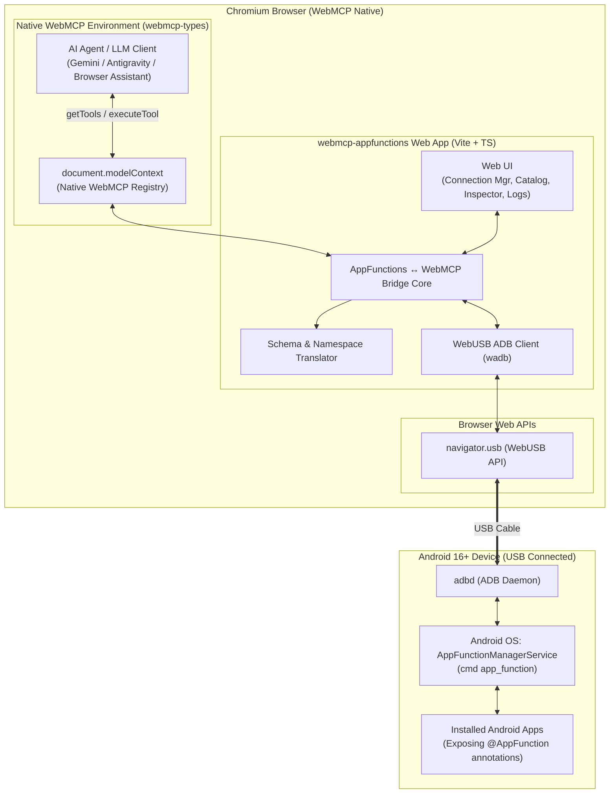
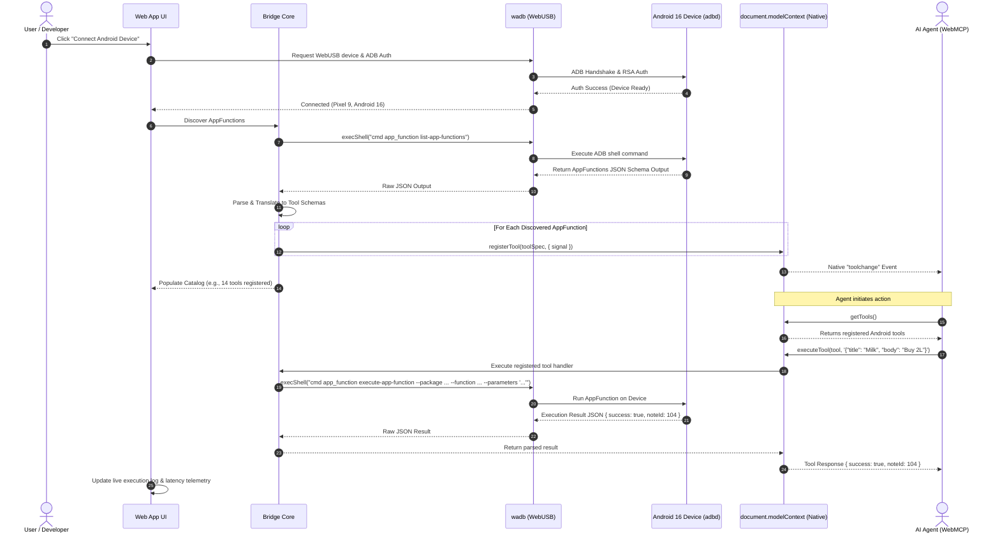

# Product Requirements Document (PRD)

## Project Name: `webmcp-appfunctions`
**Subtitle:** WebMCP ↔ Android AppFunctions Bridge via WebUSB (wadb)  
**Status:** Ready for Review  
**License:** Apache-2.0  
**Target Platform:** Chromium Browsers with Native WebMCP Support & Android 16+ (API 36+)  
**Technology Stack:** Vanilla TypeScript, Vite, `wadb` (WebADB over WebUSB), `webmcp-types` (W3C Web Machine Learning CG)

---

## 1. Executive Summary & Problem Statement

### 1.1 Context & Background
- **Native WebMCP Imperative API (`document.modelContext`):** The browser-level standard developed by the W3C Web Machine Learning Community Group that enables web applications to expose structured JavaScript tools directly to AI agents via native `document.modelContext` (`registerTool`, `getTools`, `executeTool`, and `toolchange` events with `AbortSignal` lifecycle support).
- **Official WebMCP Type Definitions (`webmcp-types`):** The official npm package [`webmcp-types`](https://www.npmjs.com/package/webmcp-types) from the Web Machine Learning Working Group, providing canonical TypeScript declarations for native `document.modelContext`, tool registrations, parameter schemas, and type-safe tool execution.
- **Android AppFunctions (`cmd app_function`):** Introduced in Android 16 (API level 36+), AppFunctions allow Android applications to expose on-device capabilities (such as sending messages, querying local databases, controlling device hardware, or interacting with installed apps) as structured, schema-defined tools for AI assistants. Android exposes these tools over ADB via the `cmd app_function` CLI interface.
- **`wadb` (Web ADB over WebUSB):** A TypeScript implementation by Google Chrome Labs that allows browser applications to communicate directly with connected Android devices over WebUSB, executing ADB shell commands without requiring a local ADB daemon or native CLI installation.

### 1.2 The Problem
Currently, AI agents operating in web environments (such as in-browser assistants or web-based agentic workflows) are siloed within the browser sandbox and cannot natively discover or invoke capabilities provided by native Android applications on a user's connected mobile device. Conversely, testing and bridging Android AppFunctions to web-based agent runtimes requires complex multi-hop network bridges, custom servers, or native daemons.

### 1.3 The Solution
`webmcp-appfunctions` is a client-side web application built with **Vite** and **Vanilla TypeScript** that acts as a real-time hardware bridge:
1. Connects to an Android 16+ device over **WebUSB** using **`wadb`**.
2. Discovers all registered **AppFunctions** on the connected device via ADB shell (`cmd app_function list-app-functions`).
3. Automatically translates and registers these Android functions as **WebMCP tools** directly onto native **`document.modelContext`** (`document.modelContext.registerTool`) typed via the official **`webmcp-types`** package.
4. Dispatches agent tool calls from native WebMCP directly down through WebUSB to execute on the Android device via `cmd app_function execute-app-function`, returning structured JSON results back to the web agent in real time.

---

## 2. Android AppFunctions ADB Command Specifications

The bridge relies on the following standard Android 16 (API 36+) shell commands executed over `wadb`:

### 2.1 Function Discovery Command
```bash
adb shell cmd app_function list-app-functions [--package <PACKAGE_NAME>]
```
- **Description:** Lists all registered AppFunctions on the device.
- **Output:** Returns a JSON structure detailing:
  - `package`: The Android application package name (e.g. `com.example.notes`).
  - `function`: Unique identifier (typically `ClassName#MethodName`).
  - `description`: KDoc-derived documentation for the function.
  - `parameters`: Array/object of parameter definitions, data types, descriptions, and optionality.
  - `response`: Return type specification.

### 2.2 Function Execution Command
```bash
adb shell cmd app_function execute-app-function \
  --package <PACKAGE_NAME> \
  --function <CLASS_NAME#METHOD_NAME> \
  --parameters '<JSON_STRING>'
```
- **Description:** Executes the targeted AppFunction with the provided JSON parameters.
- **Input:** JSON string containing key-value pairs of argument inputs matching the function schema.
- **Output:** Returns structured JSON containing the execution status and output payload.

### 2.3 State Management Command (Optional / Dev Tools)
```bash
adb shell cmd app_function set-enabled \
  --package <PACKAGE_NAME> \
  --function <CLASS_NAME#METHOD_NAME> \
  --state <enable|disable|default>
```
- **Description:** Enables or disables specific AppFunctions for testing and debugging scenarios.

---

## 3. Goals & Non-Goals

### 3.1 Goals (In-Scope)
- **Zero-Install Connection:** Allow users to plug an Android device into their computer via USB and establish an ADB connection entirely within the browser via WebUSB (no local `adb` CLI installation required).
- **Automated Tool Discovery:** Query connected Android devices for available AppFunctions using `cmd app_function list-app-functions` and parse their parameter schemas into standard JSON Schema formats.
- **Direct Native WebMCP Registration:** Dynamically register discovered AppFunctions directly into native `document.modelContext.registerTool` strictly typed via `webmcp-types`, managing tool lifecycles via `AbortSignal`.
- **Robust Command Execution & Error Handling:** Safely format, serialize, and execute `cmd app_function execute-app-function` calls over WebUSB, capturing return values, timeouts, permission failures, and stderr traces.
- **Interactive Developer & Agent UI:** Provide a clean, intuitive web interface to:
  - Manage USB device connection and ADB authentication.
  - Inspect discovered AppFunctions, their schemas, and metadata.
  - Manually test-invoke any AppFunction with custom JSON parameters.
  - Monitor real-time WebMCP agent tool invocations, payloads, and response latencies.

### 3.2 Non-Goals (Out-of-Scope)
- **Non-WebMCP Environments / Polyfills:** No fallback polyfills for browsers without native WebMCP support. Native `document.modelContext` is a strict requirement.
- **Native Android App Development:** This project does not produce new Android APKs; it consumes existing AppFunctions exposed by apps on the target device.
- **Wireless ADB / Network Transport (Phase 1):** Phase 1 strictly targets wired WebUSB.
- **Non-Chromium Browser Support:** Since WebUSB and WebMCP are Chromium-specific capabilities, non-Chromium browsers are unsupported.

---

## 4. Architecture & System Design

### 4.1 High-Level System Architecture



### 4.2 Detailed Component Breakdown

#### 1. Transport Layer (`src/transport/`)
- **`AdbManager`**: Wraps `wadb` over `navigator.usb`.
  - Manages WebUSB permission requests (`navigator.usb.requestDevice`).
  - Handles ADB handshake, RSA authentication key generation, pairing, and connection lifecycle.
  - Provides a clean asynchronous execution interface: `execShell(command: string): Promise<ShellResult>`.
  - Emits connection status events (`disconnected`, `connecting`, `authorizing`, `ready`, `error`).

#### 2. Android AppFunctions Client (`src/android/`)
- **`AppFunctionsDiscovery`**:
  - Executes `cmd app_function list-app-functions` (or package-targeted queries).
  - Parses the raw JSON output emitted by Android 16's `app_function` command line utility.
  - Extracts package names, class names, function identifiers, parameter types, optionality, and KDoc descriptions.
- **`AppFunctionsExecutor`**:
  - Constructs `cmd app_function execute-app-function --package <pkg> --function <funcId> --parameters '<json>'`.
  - Validates and sanitizes JSON parameter inputs.
  - Captures stdout/stderr, parses return payloads, and maps error codes to standard WebMCP exceptions.

#### 3. WebMCP Bridge Core (`src/webmcp/`)
- **`WebMCPRegistry`**:
  - Strictly typed with the official `webmcp-types` package.
  - Interacts directly with native `document.modelContext`.
  - Converts Android AppFunctions schemas into WebMCP-compliant tool definitions matching `webmcp-types`.
  - Registers tools via `document.modelContext.registerTool(tool, { signal })`.
  - Automatically aborts / unregisters tools via `AbortController` when the Android device disconnects.

#### 4. UI Layer (`src/ui/`)
- **`ConnectionBar`**: Device status pill, "Connect USB Device" button, device info (manufacturer, model, Android version), WebMCP availability check.
- **`FunctionCatalog`**: Searchable, filterable accordion list of discovered packages and functions.
- **`FunctionTester`**: Dynamic form generator based on JSON schema, allowing developers to manually input arguments and view formatted JSON execution results.
- **`LogViewer`**: Filterable console streaming WebUSB events, ADB shell output, and WebMCP tool lifecycle events.

---

## 5. End-to-End Data Flow & Sequence Diagram



---

## 6. Functional Requirements & Specifications

### 6.1 USB & ADB Connection Module (FR-CONN)
| ID | Requirement | Priority | Details |
| :--- | :--- | :--- | :--- |
| **FR-CONN-1** | WebUSB Device Selection | P0 | Use `navigator.usb.requestDevice({ filters: [{ classCode: 255, subclassCode: 66, protocolCode: 1 }] })` to select ADB-enabled Android devices. |
| **FR-CONN-2** | In-Browser RSA Key Auth | P0 | Generate/load persistent RSA keypair in browser `localStorage`/`IndexedDB` for ADB authentication. |
| **FR-CONN-3** | Disconnect Handling | P0 | Gracefully clean up state, abort registered tool controllers to unregister from `document.modelContext`, and notify UI. |
| **FR-CONN-4** | Connection Diagnostics | P1 | Surface clear error messages for common issues (unauthorized, USB busy, device locked, unsupported Android version). |

### 6.2 AppFunctions Discovery & Schema Translation (FR-DISC)
| ID | Requirement | Priority | Details |
| :--- | :--- | :--- | :--- |
| **FR-DISC-1** | Query AppFunctions | P0 | Execute `cmd app_function list-app-functions` via `wadb.shell`. |
| **FR-DISC-2** | Schema Parsing | P0 | Parse function identifiers, package names, parameters, primitive types (string, int, float, bool), arrays, and nested objects. |
| **FR-DISC-3** | WebMCP Schema Mapping | P0 | Convert Android type descriptors into standard JSON Schema (`type: "object"`, `properties: {...}`, `required: [...]`). |
| **FR-DISC-4** | Tool Naming Conventions | P0 | Sanitize names to match WebMCP regex requirements (e.g. `[a-zA-Z0-9_-]+`). |
| **FR-DISC-5** | Dynamic Refresh | P1 | Support manual or automatic re-indexing when apps are installed or updated. |

### 6.3 WebMCP Tool Registration & Execution (FR-EXEC)
| ID | Requirement | Priority | Details |
| :--- | :--- | :--- | :--- |
| **FR-EXEC-1** | Native WebMCP Registration | P0 | Register all mapped functions directly on `document.modelContext.registerTool(tool, { signal })`. |
| **FR-EXEC-2** | Parameter Serialization | P0 | Safely serialize tool arguments into JSON strings, escaping quotes and shell meta-characters for ADB CLI arguments. |
| **FR-EXEC-3** | Output Formatting | P0 | Parse and structure the response from `cmd app_function execute-app-function`, distinguishing successful returns from application errors. |
| **FR-EXEC-4** | Timeout & Cancellation | P1 | Enforce configurable timeouts (default: 10s) and support `AbortSignal` cancellation on AppFunction execution over WebUSB. |

### 6.4 User Interface & Telemetry (FR-UI)
| ID | Requirement | Priority | Details |
| :--- | :--- | :--- | :--- |
| **FR-UI-1** | Modern Responsive UI | P0 | Clean, developer-friendly interface built with Vanilla TypeScript and CSS. |
| **FR-UI-2** | Function Explorer | P0 | Searchable tree/card list grouped by Android package with full parameter documentation. |
| **FR-UI-3** | Manual Invocation Form | P0 | Auto-generated input fields matching the parameter schema with immediate execution feedback. |
| **FR-UI-4** | Telemetry & Packet Log | P1 | Collapsible real-time log drawer with color-coded tags (`[USB]`, `[ADB]`, `[WebMCP]`, `[EXEC]`). |

---

## 7. Technical Dependencies & Configurations

### 7.1 Package Dependencies
```json
{
  "name": "webmcp-appfunctions",
  "private": true,
  "version": "0.1.0",
  "type": "module",
  "scripts": {
    "dev": "vite",
    "build": "tsc && vite build",
    "preview": "vite preview"
  },
  "dependencies": {
    "webmcp-types": "latest"
  },
  "devDependencies": {
    "@types/w3c-web-usb": "^1.0.10",
    "typescript": "^5.5.0",
    "vite": "^5.4.0"
  }
}
```

### 7.2 Directory Structure
```
webmcp-appfunctions/
├── index.html
├── package.json
├── tsconfig.json
├── vite.config.ts
├── src/
│   ├── main.ts                     # Application entry point & bootstrapping
│   ├── styles/                     # Modern UI styling & themes
│   │   └── main.css
│   ├── types/                      # Type definitions
│   │   ├── adb.ts                  # wadb & shell types
│   │   └── appfunctions.ts         # Android AppFunctions schema types
│   ├── transport/                  # WebUSB / ADB communication
│   │   ├── adb-client.ts           # wadb wrapper and connection lifecycle
│   │   ├── auth-keys.ts            # Browser RSA keypair storage & generation
│   │   └── shell.ts                # Command formatting & stream processor
│   ├── android/                    # Android AppFunctions parsing & execution
│   │   ├── discovery.ts            # Parser for 'cmd app_function list-app-functions'
│   │   ├── executor.ts             # 'cmd app_function execute-app-function' runner
│   │   └── parser.ts               # Schema & output parser
│   ├── webmcp/                     # WebMCP bridge
│   │   ├── bridge.ts               # AppFunctions ↔ native document.modelContext registrar
│   │   └── schema-mapper.ts        # Android types to JSON Schema converter
│   ├── ui/                         # Vanilla TS UI components
│   │   ├── connection-bar.ts       # USB connect button & device info banner
│   │   ├── catalog-view.ts         # Discovered functions list & search
│   │   ├── tester-view.ts          # Manual argument tester form
│   │   └── log-drawer.ts           # Real-time streaming log component
│   └── utils/                      # Helper utilities
│       ├── logger.ts               # Structured logger with event emitter
│       └── sanitize.ts             # Shell argument escaping & sanitization
└── tests/                          # Unit & integration tests
    ├── discovery.test.ts
    ├── schema-mapper.test.ts
    └── executor.test.ts
```

---

## 8. Security, Privacy & Safety Considerations

1. **Explicit User Consent for USB Access:**
   - WebUSB strictly requires a user-gesture (clicking a button) to trigger the device selection dialog. No background or hidden connection is possible.
2. **Android OS-Level USB Debugging Protection:**
   - The user must explicitly unlock their phone and authorize the computer's RSA key fingerprint ("Always allow from this computer").
3. **Shell Command Sanitization:**
   - All parameter values passed to `cmd app_function execute-app-function` must be strictly sanitized and JSON-encoded to prevent shell injection or arbitrary command execution on the host Android device.
4. **Agent Tool Call Visibility:**
   - The UI provides real-time logging and telemetry for AppFunctions invocations.
5. **Open Source Licensing & SPDX Headers:**
   - The project is licensed under **Apache-2.0**.
   - Every source file (`.ts`, `.js`, `.css`, `.html`, etc.) must include a standard Apache-2.0 license header with `SPDX-License-Identifier: Apache-2.0`.

---

## 9. Project Roadmap & Implementation Milestones

### Phase 1: Project Setup & Transport Foundation
- Initialize Vite + TypeScript project.
- Configure `package.json` with the official `webmcp-types` and `@types/w3c-web-usb`.
- Configure `tsconfig.json` with `webmcp-types` in `types`.
- Add `LICENSE` (Apache-2.0) and configure SPDX headers on all source files.
- Integrate `wadb` for WebUSB ADB connection.
- Implement RSA key generation, persistent browser storage, and connection lifecycle UI.
- Verify basic `adb shell` execution over WebUSB in the browser.

### Phase 2: AppFunctions Discovery & Schema Parsing
- Implement `AppFunctionsDiscovery` to run and parse `cmd app_function list-app-functions`.
- Create robust schema parser and normalizer into standard JSON Schema.
- Build the **Function Catalog & Documentation UI**.

### Phase 3: WebMCP Bridge & Execution Engine
- Implement direct native `document.modelContext.registerTool` bridge typed via `webmcp-types`.
- Implement `AppFunctionsExecutor` to serialize parameters and execute `cmd app_function execute-app-function`.
- Connect tool invocations to the native WebMCP runtime.
- Build the **Manual Invocation & Argument Tester UI**.

### Phase 4: Live Telemetry & Polish
- Implement the **Real-Time Streaming Log Drawer** with latency tracking.
- End-to-end integration testing and validation.

---

## 10. Acceptance Criteria

- [ ] Web application connects to an Android 16+ device over WebUSB without any server-side dependencies.
- [ ] Successfully queries and lists all installed AppFunctions with their parameters and descriptions via `cmd app_function list-app-functions`.
- [ ] Registers discovered AppFunctions directly into native `document.modelContext` as valid WebMCP tools typed via official `webmcp-types`.
- [ ] Calling a registered WebMCP tool via `document.modelContext.executeTool` executes `cmd app_function execute-app-function` on the Android device and returns structured JSON output.
- [ ] Developer can manually test and inspect any AppFunction through the web UI.
- [ ] Project is licensed under Apache-2.0 with valid `LICENSE` file.
- [ ] All source files contain the required Apache-2.0 SPDX license header.
- [ ] Application contains unit tests covering schema parsing, argument escaping, and WebMCP tool registration.
